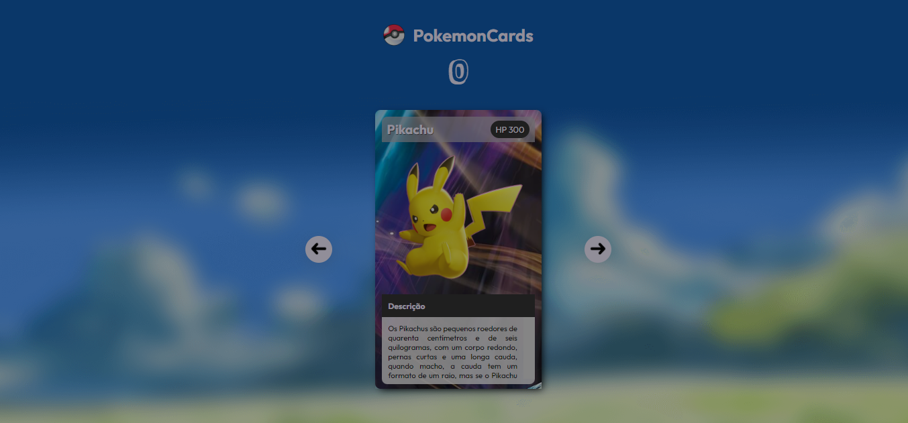
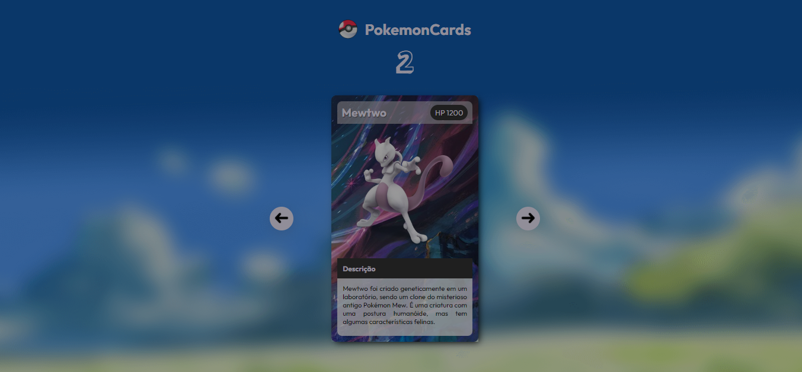

# Projeto pokémonSlides

## Aplicação
Aplicação está disponível através do link: <a target="_blank" href="https://leandroncosta.github.io/projeto-pokemonCards/">Clique aqui</a> 

## O que é?
- A aplicação são slides / card com alguns personagens do anime Pokémon contendo algumas informações sobre o mesmo. 
- Ao clicar nas setas é passado para o próximo personagem / card como se fosse um baralho

## Tecnologias :
- HTML
- CSS
- JavaScript 

## Demonstração

